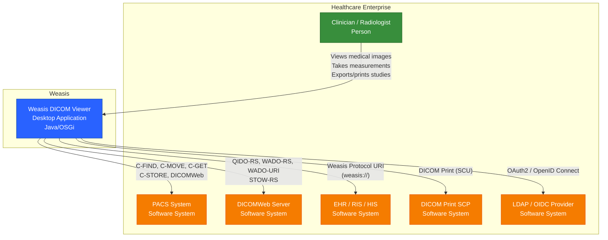
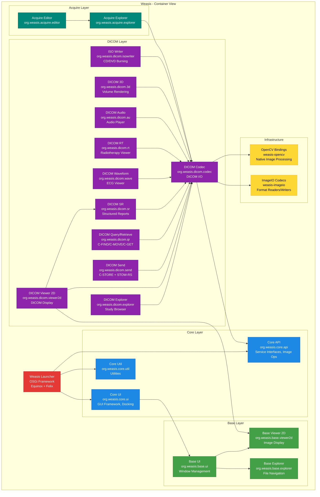
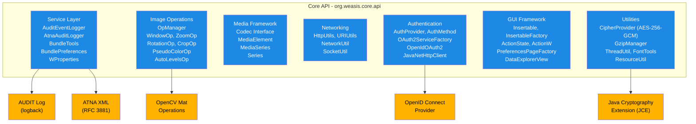
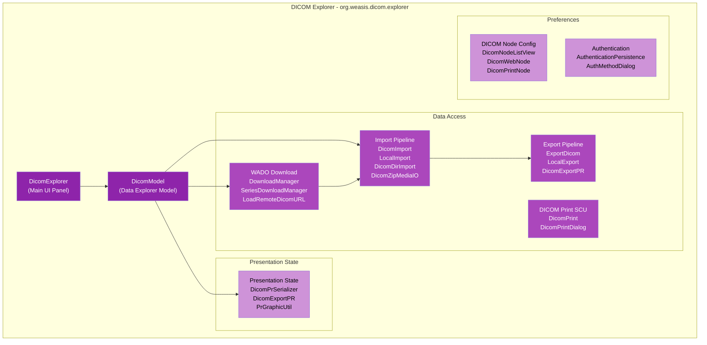
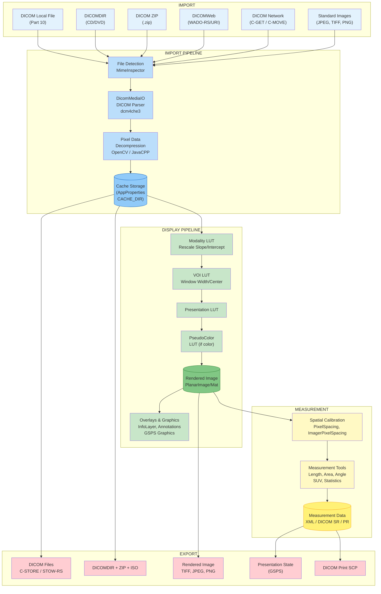
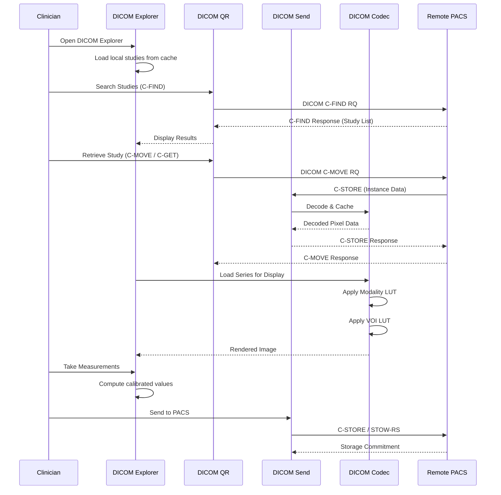
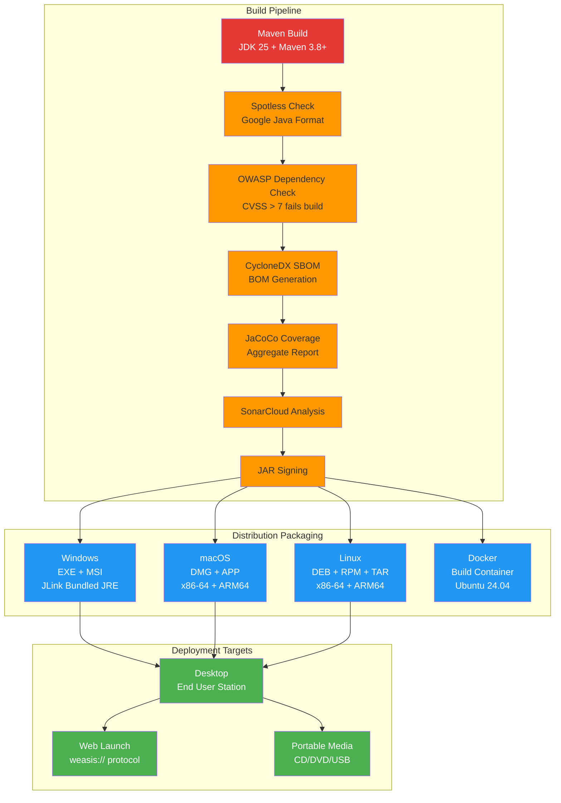
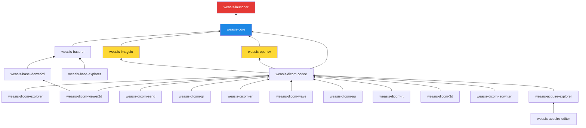

# Weasis Software Architecture Document

| Field | Value |
|---|---|
| Document ID | WES-ARCH-001 |
| Version | 1.0 |
| Date | 2026-05-02 |
| Status | DRAFT |
| Classification | Internal |
| Template | IEC 62304 - Software Architecture |

---

## 1. Introduction

### 1.1 Purpose

This document describes the software architecture of Weasis, an open-source DICOM viewer for medical image visualization. It follows the C4 model (Context, Containers, Components) and addresses the architecture requirements of IEC 62304 for medical device software.

### 1.2 Scope

The scope covers the software architecture of Weasis version 4.7.0, including all modules, interfaces, data flows, deployment options, and security mechanisms.

### 1.3 Definitions and Acronyms

| Term | Definition |
|---|---|
| AE | Application Entity (DICOM) |
| DICOM | Digital Imaging and Communications in Medicine |
| DICOMWeb | RESTful DICOM services (QIDO-RS, WADO-RS, STOW-RS) |
| GSPS | Grayscale Softcopy Presentation State |
| IHE | Integrating the Healthcare Enterprise |
| ATNA | Audit Trail and Node Authentication |
| MPR | Multiplanar Reconstruction |
| OSGi | Open Services Gateway Initiative |
| PACS | Picture Archiving and Communication System |
| SCP | Service Class Provider |
| SCU | Service Class User |
| SOP | Service-Object Pair |

### 1.4 References

- IEC 62304:2006 + AMD1:2015 - Medical Device Software - Software Life Cycle Processes
- ISO 14971:2019 - Risk Management for Medical Devices
- DICOM PS3.1-PS3.20 - DICOM Standard
- IHE IT Infrastructure Technical Framework
- WES-RISK-001 - Risk Assessment Document

---

## 2. System Overview

Weasis is a multi-platform desktop DICOM viewer built on the Eclipse Equinox OSGi framework. It uses the dcm4che3 library for DICOM network operations and OpenCV (via JavaCPP) for image decompression and processing. The software operates as a modular, plugin-based architecture where each functional unit is an OSGi bundle.

**Key architectural characteristics:**
- **OSGi modularity**: Eclipse Equinox framework with hot-pluggable bundles
- **Plugin-based**: All modules are OSGi bundles with well-defined service interfaces
- **Cross-platform**: Java 25 runtime on Windows, macOS, Linux (x86-64, ARM64)
- **Dual-licensing**: EPL 2.0 and Apache 2.0

---

## 3. C4 Model Diagrams

### 3.1 Context Diagram (Level 1)



### 3.2 Container Diagram (Level 2)



### 3.3 Component Diagram (Level 3) - Core API



### 3.4 Component Diagram (Level 3) - DICOM Explorer



---

## 4. Module Responsibilities

### 4.1 weasis-parent

Maven parent POM providing shared configuration: dependency management, plugin configuration (Spotless, OWASP Dependency Check, CycloneDX SBOM, JaCoCo, SonarCloud), build profiles, and version definitions (Java 25, OSGi 8, dcm4che3, OpenCV 4.13).

### 4.2 weasis-launcher

**Responsibility**: OSGi framework bootstrap and application lifecycle management.

- Initializes Eclipse Equinox / Apache Felix OSGi framework
- Configures Felix start levels, bundle cache, system packages
- Resolves and installs bundles from `base.json`, `dicomizer.json`, or `non-dicom-explorer.json` profiles
- Manages the weasis protocol handler (`weasis://`) for browser-to-application launch
- Provides the `Launcher` main class and `ConfigData` loading

### 4.3 weasis-core

**Responsibility**: Central API bundle providing shared interfaces, utilities, and the GUI docking framework. This is the architectural kernel.

**Key packages and their responsibilities:**

| Package | Responsibility |
|---|---|
| `org.weasis.core.api.gui` | GUI framework contracts: `Insertable`, `InsertableFactory`, `ActionW`, `ActionState`, preferences pages |
| `org.weasis.core.api.gui.util` | UI utilities: `AppProperties`, `GuiExecutor`, `WinUtil`, font management |
| `org.weasis.core.api.image` | Image operation pipeline: `OpManager`, `WindowOp`, `ZoomOp`, `RotationOp`, `CropOp`, `PseudoColorOp`, `AutoLevelsOp`, `FlipOp`, `BrightnessOp`, `FilterOp` |
| `org.weasis.core.api.media.data` | Media model: `MediaElement`, `MediaSeries`, `Codec` interface, `TagW`, `Series`, `FileCache` |
| `org.weasis.core.api.net` | Networking: `HttpUtils`, `URIUtils`, `NetworkUtil`, authenticated HTTP client |
| `org.weasis.core.api.net.auth` | Authentication: `AuthProvider`, `AuthMethod`, `OAuth2ServiceFactory`, `OpenIdOAuth2AccessToken`, `JavaNetHttpClient` |
| `org.weasis.core.api.service` | Service layer: `AuditEventLogger`, `AtnaAuditLogger` (RFC 3881), `AuditLog`, `BundleTools`, `BundlePreferences`, `WProperties` |
| `org.weasis.core.api.util` | Utilities: `CipherProvider` (AES-256-GCM), `GzipManager`, `ThreadUtil` |
| `org.weasis.core.api.explorer` | Data explorer interfaces: `DataExplorerView`, `DataExplorerModel`, `ObservableEvent` |
| `org.weasis.core.ui` | Docking framework, viewer plugin system, `SeriesViewerUI`, `ViewerPluginBuilder`, layout management |
| `org.weasis.core.internal` | Internal Activator, MIME detection, OpenCV codec bridge |

### 4.4 weasis-imageio

**Responsibility**: Java ImageIO codec plugins for non-DICOM image formats including JPEG, PNG, BMP, TIFF, GIF, HDR, PNM, and RAS. Registers custom `ImageReaderSpi` and `ImageWriterSpi` implementations.

### 4.5 weasis-opencv

**Responsibility**: Native OpenCV bindings via JavaCPP for hardware-accelerated image processing.

- Platform-specific native libraries (4.13.0-dcm) for linux-x86-64, linux-aarch64, macosx-x86-64, macosx-aarch64, windows-x86-64
- `PlanarImage` and `Mat` data structures for pixel-level operations
- Used by DICOM codec for decompression, color space conversion, and rendering

### 4.6 weasis-base

#### weasis-base-ui
**Responsibility**: Application window lifecycle. Provides `WeasisWin`, `DesktopAdapter`, main menu, toolbar management, about dialog, licensing display, window listener framework.

#### weasis-base-viewer2d
**Responsibility**: Generic 2D image viewer container without DICOM specifics. Provides `View2d`, `View2dContainer`, `EventManager`, image tools (`ImageTool`), display tools (`DisplayTool`), info layer overlay.

#### weasis-base-explorer
**Responsibility**: Local file system explorer for browsing and opening image files. Provides tree-based file navigation with MIME type detection.

### 4.7 weasis-dicom

#### weasis-dicom-codec
**Responsibility**: DICOM media reading/writing using dcm4che3. Core data types: `DicomMediaIO`, `DicomImageElement`, `DicomSeries`, `DicomVideoElement`, `DicomEncapDocElement`, `DicomSpecialElement`. Handles DICOM tag extraction, pixel data decoding (via OpenCV), image rendering pipeline (Modality LUT, VOI LUT, Presentation LUT), transfer syntax transcoding, and DICOM metadata.

#### weasis-dicom-explorer
**Responsibility**: DICOM study management and user interface.

- `DicomModel` - Central data model (patient/study/series hierarchy)
- `DicomExplorer` - Main study browser panel
- Import pipeline: local files, DICOMDIR, ZIP archives
- Export pipeline: DICOM files, DICOMDIR, ZIP, ISO, TIFF, JPEG, PNG
- WADO download manager for remote study retrieval
- DICOM Print SCU (Basic Grayscale and Color)
- Presentation State (GSPS) import/export
- Hanging protocols configuration

#### weasis-dicom-viewer2d
**Responsibility**: DICOM-specific image viewer extending the base viewer. Adds DICOM toolbars (Modality LUT, Cine, 3D, Key Object, DCM Header), MPR and MIP viewers, info layer with DICOM overlays, presentation state rendering, measurement and annotation overlay.

#### weasis-dicom-sr
**Responsibility**: DICOM Structured Report viewer. Renders SR documents with hyperlinks to referenced images, displays measurement results, and supports SR TID (Template ID) rendering.

#### weasis-dicom-wave
**Responsibility**: DICOM Waveform viewer (ECG). Renders 12-lead and other waveform data, enables measurement cursors, gain/time base scaling, and printing.

#### weasis-dicom-au
**Responsibility**: DICOM Audio viewer. Plays back audio data encapsulated in DICOM AU objects, supports export to WAV format.

#### weasis-dicom-rt
**Responsibility**: Radiotherapy viewer. Displays RT Structure Set contours, RT Dose distributions with DVH (Dose Volume Histogram) charts, and RT Plan isodose lines.

#### weasis-dicom-3d
**Responsibility**: 3D volume rendering and MPR. Uses JOGL (JOGL 2.6.0) for OpenGL acceleration. Provides oblique MPR, Maximum Intensity Projection (MIP), and volume rendering with preset transfer functions.

#### weasis-dicom-send
**Responsibility**: DICOM Storage SCU. Implements C-STORE operation for sending DICOM objects to remote PACS and STOW-RS for DICOMWeb upload. Provides `SendDicomView` UI for selecting studies/series to send.

#### weasis-dicom-qr
**Responsibility**: DICOM Query/Retrieve SCU. Implements C-FIND (study/series/instance level), C-MOVE, C-GET, WADO-URI/WADO-RS retrieval, and QIDO-RS (DICOMWeb query). Provides `DicomQrView` for searching and retrieving studies from remote DICOM nodes.

#### weasis-dicom-isowriter
**Responsibility**: ISO image writer for creating DICOM CD/DVD images. Generates DICOMDIR files with proper Media Storage SOP Classes, and creates bootable ISO image files containing the Weasis portable viewer.

### 4.8 weasis-acquire

#### weasis-acquire-explorer
**Responsibility**: Dicomizer module for converting standard images into DICOM format. Manages acquisition sessions, metadata entry, and DICOM encapsulation workflow.

#### weasis-acquire-editor
**Responsibility**: Image editing tools for acquired images before DICOM conversion. Cropping, rotation, brightness/contrast adjustments, and annotation insertion.

### 4.9 tests

**Responsibility**: Aggregated module for running unit and integration tests across all modules. Uses JUnit 6, Mockito, and JaCoCo for coverage aggregation. Configured via `tests/pom.xml`.

---

## 5. Data Flow Architecture

### 5.1 Primary Data Flow: Import -> Store -> Display -> Measure -> Export



### 5.2 DICOM Network Data Flow



---

## 6. Interface Architecture

### 6.1 DICOM Network Interface (dcm4che3)

**Protocol**: DICOM over TCP/IP (port 11112 default or configurable)

**SCU Roles**:
- Storage SCU (C-STORE)
- Query/Retrieve SCU (C-FIND, C-MOVE, C-GET)
- Print Management SCU (Basic Grayscale Print, Basic Color Print)

**SCP Role**:
- Storage SCP (configurable DICOM listener)

**Presentation Contexts**: Supports all standard Storage SOP Classes, Query/Retrieve Information Models (Patient Root, Study Root), Print Management SOP Classes.

**Transfer Syntaxes**: Implicit VR Little Endian, Explicit VR Little Endian, Explicit VR Big Endian, JPEG Baseline, JPEG Extended, JPEG Lossless, JPEG-LS, JPEG 2000, RLE, MPEG2, MPEG4.

**Implementation**: dcm4che3 library version 5.34.2, configured via `DicomManager`.

### 6.2 DICOMWeb Interface

**Protocol**: HTTPS (RESTful)

**Services**:
| Service | Operation | Endpoint Pattern |
|---|---|---|
| QIDO-RS | Query | `{base}/rs/studies?{params}` |
| WADO-RS | Retrieve | `{base}/rs/studies/{uid}/series/{uid}/instances/{uid}` |
| WADO-URI | Retrieve | `{base}/wado?requestType=WADO&studyUID=...` |
| STOW-RS | Store | `{base}/rs/studies/{uid}` |

**Authentication**: Supports Basic Auth, OAuth2/OpenID Connect token-based auth via the `AuthProvider` framework.

### 6.3 IHE Integration Profiles

| Profile | Actor | Role |
|---|---|---|
| ATNA | Secure Application | RFC 3881 audit event generation via `AtnaAuditLogger` |
| SWF.b | Image Display Consumer | Display DICOM images with GSPS |
| PDI | Portable Media Creator | ISO image creation with DICOMDIR |

### 6.4 Local File System Interface

**Read paths**:
- DICOM Part 10 files: Read via `DicomMediaIO` using `DicomFileInputStream`
- DICOMDIR: Parsed via `DicomDirLoader` with dcm4che3 `DicomDirReader`
- ZIP archives: Extracted via `DicomZipCodec` (zip4j 2.11.5)
- Non-DICOM images: Read via Java ImageIO with weasis-imageio codecs

**Write paths**:
- DICOM export: Written via `DicomOutputStream`
- DICOMDIR: Generated via `DicomDirBuilder`
- ISO images: Created via `IsoWriter` with CD/DVD UDF format
- Rendered images: TIFF/JPEG/PNG format via Java ImageIO

**Cache structure**:
```
~/.weasis/
  cache/           # Bundle cache
  dicom/           # DICOM export temp directory
  dcm-rawcv/       # Uncompressed DICOM pixel data (OpenCV)
  log/             # Application logs (rolling file)
  audit-{user}.log # Audit trail log
  pref/            # Bundle preferences
```

### 6.5 Weasis Protocol Interface

**Protocol scheme**: `weasis://`

**Format**: `weasis://{command}/{params}`

**Commands**: `DICOM` (load studies), `IMPORT` (import file), `VIEWER` (open viewer with presets)

**Implementation**: Processed by the launcher, which parses the URI and dispatches to appropriate bundles. The protocol can be registered with the OS as a URI scheme handler for browser-based launch.

---

## 7. Security Architecture

### 7.1 Encryption - CipherProvider

**Class**: `org.weasis.core.api.util.CipherProvider`

**Algorithm**: AES-256-GCM

**Characteristics**:
- Key size: 256 bits
- Mode: GCM (Galois/Counter Mode) - authenticated encryption
- IV: 12 bytes (random, prepended to ciphertext)
- Tag length: 128 bits
- Key generation: `SecureRandom` via `KeyGenerator`
- Key serialization: Base64 encoded/decoded

**Usage**: Protecting DICOM data at rest (encrypted local cache). Referenced by issue #21.

**Implementation** (`weasis-core/src/main/java/.../CipherProvider.java:46`):
```java
public static OutputStream encryptStream(OutputStream outputStream, SecretKey key)
public static InputStream decryptStream(InputStream inputStream, SecretKey key)
```

### 7.2 Audit Trail - AuditEventLogger & AtnaAuditLogger

**Classes**:
- `org.weasis.core.api.service.AuditEventLogger`
- `org.weasis.core.api.service.AtnaAuditLogger`
- `org.weasis.core.api.service.AuditLog`

**Capabilities**:
- Structured audit events for HIPAA / IHE ATNA compliance
- Events: study view, export, print, import, delete, login, logout, configure, launch
- Log injection prevention via `sanitize()` method (control character removal)
- Rolling audit log files: 10 files of 20MB each
- RFC 3881 XML format for ATNA messages
- Outcome indicators: SUCCESS (0), MINOR_FAILURE (4), MAJOR_FAILURE (12)

**Code references**:
- `AuditEventLogger.logStudyAccess()` at `weasis-core/.../AuditEventLogger.java:78`
- `AtnaAuditLogger.format()` at `weasis-core/.../AtnaAuditLogger.java:450`
- `AuditLog.getAuditProperties()` at `weasis-core/.../AuditLog.java:69`

### 7.3 Authentication & Authorization

**Framework**: `org.weasis.core.api.net.auth`

**Supported methods**:
- `DefaultAuthMethod` - Basic HTTP authentication
- `OAuth2ServiceFactory` - OAuth2 authorization code flow
- `OpenIdOAuth2AccessToken` - OpenID Connect token handling

**Components**:
- `AuthProvider` - Service interface for pluggable authentication
- `AuthMethod` - Abstract authentication method with credential storage
- `JavaNetHttpClient` - Authenticated HTTP client with token refresh
- `AsyncCallbackServerHandler` - Local HTTP server for OAuth2 callback

### 7.4 Image Operation Security

All image operations in `org.weasis.core.api.image` implement bounds checking and input validation:
- `WindowOp`: Window width/center clamped to valid range
- `ZoomOp`: Scale factors bounded to prevent resource exhaustion
- `RotationOp`: Rotation angles normalized to 0-360 degrees
- `CropOp`: Crop regions validated against image dimensions

### 7.5 Supply Chain Security

- **OWASP Dependency Check**: Plugin `dependency-check-maven` 12.1.0 with CVSS threshold 7.0 (`failBuildOnCVSS>7`), suppression file `owasp-suppressions.xml`. Referenced by issue #36.
- **CycloneDX SBOM**: `cyclonedx-maven-plugin` 2.9.1 generates aggregate BOM on package phase.
- **Spotless**: `spotless-maven-plugin` 3.2.0 with Google Java Format 1.37.0 for consistent code quality.
- **SonarCloud**: Static analysis with security, reliability, and maintainability ratings.
- **JaCoCo**: Code coverage aggregated across all modules.
- **JAR Signing**: `maven-jarsigner-plugin` 3.1.0 for code signing.

---

## 8. Deployment View

### 8.1 Desktop Deployments



### 8.2 System Requirements

| Component | Minimum | Recommended |
|---|---|---|
| OS | Windows 10+, macOS 12+, Linux (x86-64/ARM64) | Latest OS |
| Java Runtime | JRE 21 (bundled in distributions) | JRE 25 |
| RAM | 2 GB | 8 GB |
| Disk Space | 500 MB (application) | 10 GB (cache) |
| Display | 1280x1024, 24-bit color | 1920x1080+ calibrated |
| GPU | OpenGL 3.3+ (for 3D) | Dedicated GPU |
| Network | DICOM connectivity to PACS | 100 Mbps+ |

---

## 9. Module Dependency Graph



---

## 10. Software Unit Implementation

### 10.1 Technology Stack

| Component | Technology | Version |
|---|---|---|
| Programming Language | Java | 25 |
| Build System | Maven | 3.8+ |
| OSGi Framework | Eclipse Equinox / Apache Felix | 7.0.5 |
| DICOM Toolkit | dcm4che3 | 5.34.2 |
| Image Processing | OpenCV (via JavaCPP) | 4.13.0 |
| 3D Rendering | JOGL (JogAmp) | 2.6.0 |
| UI Components | FlatLaf, MigLayout, Docking Frames | 3.7.1, 11.4.2, 1.1.7 |
| Logging | SLF4J + Logback | 2.0.17, 1.5.25 |
| JSON Processing | Jackson | 2.18.3 |
| XML Binding | JAXB | 4.0.3 |
| OAuth | ScribeJava | 8.3.3 |
| Charts | XChart | 3.8.8 |
| Testing | JUnit, Mockito | 6.0, 5.21 |

### 10.2 OSGi Bundle Configuration

Each module is packaged as an OSGi bundle using `bnd-maven-plugin` 7.2.1 with the following standard configuration:

```xml
<configuration>
  <bnd>
    -noextraheaders: true
    Export-Package: org.weasis.*
    Import-Package: org.slf4j;version="[2.0,3)",*
  </bnd>
</configuration>
```

Bundle symbolic names follow the pattern `org.weasis.{layer}.{module}`.

### 10.3 Build Reproducibility

The build is configured for reproducible builds:
- `project.build.outputTimestamp=1` in parent POM
- Flatten Maven Plugin for CI-friendly versions
- JAR signing via `maven-jarsigner-plugin`

---

## 11. Error Handling Strategy

| Layer | Strategy | Implementation |
|---|---|---|
| Network | Retry with exponential backoff | `DownloadManager`, `HttpUtils` |
| DICOM | Status code handling per DIMSE | dcm4che3 `Status` class |
| Image Decode | Graceful degradation | `DicomMediaIO` fallback codecs |
| File I/O | Stream closure in finally/try-with-resources | Throughout codebase |
| Security | Fail-secure with logged exception | `CipherProvider`, `AuditEventLogger` |
| GUI | SwingWorker for background tasks | `GuiExecutor`, `DicomTaskManager` |
| OSGi | Service tracking with null checks | `BundleTools`, `BundlePreferences` |

---

## 12. Internationalization

Weasis supports multi-language localization using standard Java `ResourceBundle` properties files:

- `Messages.properties` (default: English)
- `Messages_{locale}.properties` for each supported locale
- Messages files embed annotations for translators: `Alt+A`, `Alt+A, Alt+S`
- Located under `src/main/java/**/messages*.properties` (configured in POM resources)

---

## 13. Configuration Management

### 13.1 Server-Side Configuration

Configuration is managed through the `BundlePreferences` service, which retrieves properties from:
1. Default preferences bundled with the application
2. Server-provided configuration (preferences service URL)
3. User overrides (local preferences)

### 13.2 DICOM Node Configuration

DICOM network destinations are configured through the preference UI:
- DICOM nodes (AE Title, hostname, port)
- DICOMWeb nodes (base URL, authentication)
- DICOM Print nodes (medium type, film size, resolution)

Stored via `WProperties` serialization with optional AES-256-GCM encryption for credentials.

---

## 14. Monitoring & Diagnostics

- **Audit Log**: `audit-{user}.log` with rolling policy
- **Application Log**: Configured via Logback with configurable level, pattern, file rotation
- **Performance Marker**: `*PERF*` marker for performance tracing
- **SonarCloud**: Continuous quality monitoring
- **Memory**: Soft references for image cache (`SoftHashMap`) to prevent OOM

---

## 15. Revisions

| Version | Date | Author | Description |
|---|---|---|---|
| 1.0 | 2026-05-02 | Weasis Team | Initial architecture document |
