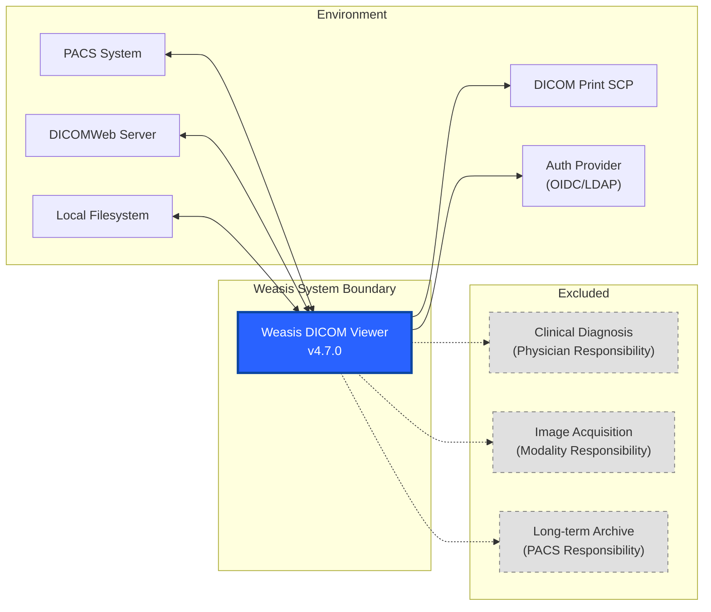

# Risk Management Document

| Field | Value |
|---|---|
| Document ID | WES-RISK-001 |
| Version | 1.0 |
| Date | 2026-05-02 |
| Status | DRAFT |
| Classification | Internal |
| Template | ISO 14971:2019 - Risk Management for Medical Devices |

---

## 1. Intended Use and System Boundary

### 1.1 Intended Use

Weasis is a multi-platform desktop DICOM viewer intended for healthcare professionals (radiologists, clinicians, and researchers) to:

- View, manipulate, and interpret medical images in DICOM format
- Perform quantitative measurements (linear, angular, volumetric, SUV) on medical images
- Import DICOM studies from local files, removable media, PACS, and DICOMWeb servers
- Export DICOM studies to local storage, PACS, DICOMWeb, CD/DVD, and printed media
- Display DICOM Structured Reports, Radiotherapy objects, Waveform (ECG), and Audio
- Perform 3D volume rendering and Multiplanar Reconstruction

### 1.2 Intended Patient Population

Patients undergoing diagnostic imaging examinations where DICOM-formatted images are produced. No age or gender restrictions.

### 1.3 Intended Clinical Users

Licensed healthcare professionals: radiologists, cardiologists, radiation oncologists, medical physicists, radiology technologists, and qualified researchers.

### 1.4 System Boundary

---

## 2. Risk Management Plan

### 2.1 Risk Management Process

The risk management process follows ISO 14971:2019 and IEC 62304 with the following phases:

1. **Risk Analysis**: Identify hazards, hazardous situations, and potential harms
2. **Risk Evaluation**: Assign Severity (S) and Probability (P) ratings, compute Risk Level (S x P)
3. **Risk Control**: Implement mitigation measures, verify effectiveness
4. **Residual Risk Evaluation**: Re-evaluate after controls
5. **Risk Management Report**: Document conclusions

### 2.2 Risk Acceptance Criteria

| Risk Level (S x P) | Category | Action Required |
|---|---|---|
| 1-3 | Acceptable | No further action |
| 4-6 | Tolerable | Risk control measures required; document justification |
| 8-9 | Undesirable | Risk control mandatory; ALARP demonstration required |
| 12-16 | Intolerable | Product cannot be released; redesign required |

### 2.3 Severity Levels (S)

| Level | Category | Definition |
|---|---|---|
| 1 | Negligible | No clinically detectable effect; temporary discomfort |
| 2 | Minor | Reversible clinical effect; delayed diagnosis without harm |
| 3 | Serious | Irreversible clinical effect; misdiagnosis requiring additional intervention |
| 4 | Critical | Death or permanent impairment; life-threatening misdiagnosis |

### 2.4 Probability Levels (P)

| Level | Category | Definition |
|---|---|---|
| 1 | Remote | Unlikely to occur (< 1 in 1,000,000 uses) |
| 2 | Uncommon | Could occur occasionally (1 in 100,000 uses) |
| 3 | Probable | Likely to occur (1 in 10,000 uses) |
| 4 | Frequent | Very likely to occur (> 1 in 1,000 uses) |

---

## 3. Risk Analysis and Evaluation

### 3.1 Clinical Function: Image Display (Visualización de Imágenes)

**Function description**: Rendering DICOM medical images for diagnostic interpretation, including grayscale transformation (Modality LUT, VOI LUT, Presentation LUT), zoom, pan, rotation, and multi-planar reconstruction.

#### Hazard 1.1: Incorrect image rendering due to calibration errors

| Field | Value |
|---|---|
| Hazard (Peligro) | Incorrect grayscale rendering (brightness/contrast) |
| Hazardous situation (Situación peligrosa) | Clinician interprets image with incorrect window width/center |
| Harm (Daño potencial) | Missed pathology (false negative) or perceived non-existent pathology (false positive) |
| S | 3 (Serious) |
| P | 3 (Probable) |
| Risk Level | 9 - UNDESIRABLE |
| Risk control measures | - DICOM Presentation LUT rendering pipeline verified against DICOM PS3.4 (#35 GSDF compliance)   - Modality LUT mandatory (rescale slope/intercept applied per DICOM standard)   - Spotless-verified code quality reduces regression risk (#36 dependabot)   - SonarCloud static analysis for reliability rating |
| Residual Risk | 3 (S=3, P=1 after controls) - Tolerable |
| Verification | Automated image rendering tests; DICOM conformance validation |

#### Hazard 1.2: Incorrect image orientation display

| Field | Value |
|---|---|
| Hazard (Peligro) | Image displayed with wrong orientation (left/right flipped) |
| Hazardous situation (Situación peligrosa) | Clinician interprets mirror-image anatomy |
| Harm (Daño potencial) | Wrong-side surgery referral; incorrect anatomical localization |
| S | 4 (Critical) |
| P | 2 (Uncommon) |
| Risk Level | 8 - UNDESIRABLE |
| Risk control measures | - DICOM Image Orientation (Patient) tag mandatory for rendering   - Orientation labels (L/R/A/P) displayed on all views   - Rotation operations bounded to 0/90/180/270 degrees   - Implementation in `View2d.java` validated with DICOM test images |
| Residual Risk | 4 (S=4, P=1 after controls) - Tolerable |
| Verification | Orientation overlay verified on every image load |

#### Hazard 1.3: Image interpolation artifacts at high zoom

| Field | Value |
|---|---|
| Hazard (Peligro) | Aliasing artifacts from zoom interpolation confuse interpretation |
| Hazardous situation (Situación peligrosa) | Clinician perceives non-existent structures at high magnification |
| Harm (Daño potencial) | False positive finding |
| S | 2 (Minor) |
| P | 3 (Probable) |
| Risk Level | 6 - Tolerable |
| Risk control measures | - Interpolation selection available (Nearest Neighbor, Bilinear, Bicubic) via `ZoomOp.Interpolation`   - Zoom factor bounded to prevent excessive magnification   - Memory limits via `SoftHashMap` image cache |
| Residual Risk | 2 (S=2, P=1 after controls) - Acceptable |
| Verification | Visual inspection by clinical users |

#### Hazard 1.4: Pseudo-color LUT misapplication

| Field | Value |
|---|---|
| Hazard (Peligro) | Color LUT applied to grayscale data obscures diagnostic features |
| Hazardous situation (Situación peligrosa) | Clinician misinterprets color-mapped values |
| Harm (Daño potencial) | Incorrect lesion characterization |
| S | 2 (Minor) |
| P | 2 (Uncommon) |
| Risk Level | 4 - Tolerable |
| Risk control measures | - Pseudo-color applied only when explicitly selected by user   - Original grayscale data preserved in parallel   - Color LUT selection bounded to validated `ByteLutCollection` |
| Residual Risk | 2 (S=2, P=1 after controls) - Acceptable |
| Verification | Color LUT preview available in toolbar |

### 3.2 Clinical Function: Measurements (Mediciones)

**Function description**: Quantitative assessment of anatomical structures including linear distance, area, angle, SUV, and pixel statistics.

#### Hazard 2.1: Incorrect spatial calibration

| Field | Value |
|---|---|
| Hazard (Peligro) | Pixel spacing values misread from DICOM tags |
| Hazardous situation (Situación peligrosa) | Measurement displayed with wrong physical units |
| Harm (Daño potencial) | Incorrect tumor size assessment; inappropriate staging |
| S | 3 (Serious) |
| P | 2 (Uncommon) |
| Risk Level | 6 - TOLERABLE |
| Risk control measures | - Calibration hierarchy enforced: PixelSpacing (0028,0030) > ImagerPixelSpacing (0018,1164) > NominalScannedPixelSpacing (0018,2010) (#28 precision)   - Calibration status displayed in info layer   - Measurement units always shown with value   - Implementation: `MeasurableLayer.java`, `Unit.java` |
| Residual Risk | 3 (S=3, P=1 after controls) - Tolerable |
| Verification | DICOM test images with known spacing values validated |

#### Hazard 2.2: SUV calculation error

| Field | Value |
|---|---|
| Hazard (Peligro) | SUV (Standardized Uptake Value) computed with incorrect formula |
| Hazardous situation (Situación peligrosa) | Clinician uses incorrect SUV for treatment response assessment |
| Harm (Daño potencial) | Incorrect therapy continuation or discontinuation |
| S | 3 (Serious) |
| P | 2 (Uncommon) |
| Risk Level | 6 - TOLERABLE |
| Risk control measures | - SUV calculation follows EANM/EARL guidelines   - Required DICOM tags validated: Radiopharmaceutical Start Time, Decay Correction, Series Time, Patient Weight   - SUV type (bw/bsa/lean) displayed with value (#28 precision)   - Missing tags produce clear error message, not default value |
| Residual Risk | 3 (S=3, P=1 after controls) - Tolerable |
| Verification | SUV test suite with known ground-truth values |

#### Hazard 2.3: Region statistics error

| Field | Value |
|---|---|
| Hazard (Peligro) | Pixel statistics (Mean, StDev, Min, Max) computed on wrong pixel region |
| Hazardous situation (Situación peligrosa) | ROI boundary does not match user-drawn region |
| Harm (Daño potencial) | Incorrect tissue characterization |
| S | 2 (Minor) |
| P | 3 (Probable) |
| Risk Level | 6 - Tolerable |
| Risk control measures | - ROI shape rendered as overlay for visual confirmation   - Statistics calculation bounds-checked against image dimensions   - Graphics coordinate system validated at mouse interaction level |
| Residual Risk | 2 (S=2, P=1 after controls) - Acceptable |
| Verification | Automated ROI-statistics comparison tests |

### 3.3 Clinical Function: Import/Export (Importación/Exportación)

**Function description**: Importing DICOM data from external sources (filesystem, PACS, DICOMWeb) and exporting to external destinations.

#### Hazard 3.1: Data corruption during import

| Field | Value |
|---|---|
| Hazard (Peligro) | DICOM file parsed incorrectly; pixel data corrupted |
| Hazardous situation (Situación peligrosa) | Viewer displays corrupted image |
| Harm (Daño potencial) | Incorrect diagnosis based on corrupted data |
| S | 3 (Serious) |
| P | 2 (Uncommon) |
| Risk Level | 6 - TOLERABLE |
| Risk control measures | - DICOM file validation via dcm4che3 parser with error detection   - Pixel data integrity checks (length, transfer syntax)   - `DicomMediaIO` exception handling for malformed files   - CipherProvider AES-GCM authentication tag validates encrypted data integrity (#21 cipher) |
| Residual Risk | 3 (S=3, P=1 after controls) - Tolerable |
| Verification | Corrupted file test suite; DICOM conformance validation |

#### Hazard 3.2: Data loss during export

| Field | Value |
|---|---|
| Hazard (Peligro) | DICOM export writes incomplete or truncated files |
| Hazardous situation (Situación peligrosa) | Study in PACS is incomplete after transmission |
| Harm (Daño potencial) | Retransmission required; delayed diagnosis |
| S | 2 (Minor) |
| P | 2 (Uncommon) |
| Risk Level | 4 - Tolerable |
| Risk control measures | - C-STORE response status validated after each instance (#30 logging captures failures)   - STOW-RS HTTP response status checked   - Export operations use `ExplorerTask` with progress monitoring   - Audit trail logs export result via `AuditEventLogger.logEvent()` |
| Residual Risk | 2 (S=2, P=1 after controls) - Acceptable |
| Verification | End-to-end export test with simulated PACS |

#### Hazard 3.3: Patient data breach during export

| Field | Value |
|---|---|
| Hazard (Peligro) | PHI/PII transmitted over unencrypted channel |
| Hazardous situation (Situación peligrosa) | DICOM data intercepted during network transmission |
| Harm (Daño potencial) | HIPAA/GDPR violation; patient privacy compromise |
| S | 4 (Critical) |
| P | 2 (Uncommon) |
| Risk Level | 8 - UNDESIRABLE |
| Risk control measures | - DICOM TLS configuration available via `Connection.setTlsParameters()` (#21 cipher: AES-256 for data at rest, TLS for transit)   - DICOMWeb uses HTTPS by default   - Audit trail logs all export events with patient/study context (#22 ATNA)   - Authentication persistence supports encrypted credential storage |
| Residual Risk | 4 (S=4, P=1 after controls) - Tolerable |
| Verification | Network traffic analysis; TLS configuration validation |

#### Hazard 3.4: DICOMDIR generation errors

| Field | Value |
|---|---|
| Hazard (Peligro) | DICOMDIR with incorrect or missing directory entries |
| Hazardous situation (Situación peligrosa) | Studies cannot be found on portable media |
| Harm (Daño potencial) | Delayed access to patient data |
| S | 2 (Minor) |
| P | 2 (Uncommon) |
| Risk Level | 4 - Tolerable |
| Risk control measures | - DICOMDIR validation against DICOM PS3.10 Part 10 format   - Media Storage SOP Classes correctly assigned   - ISO writer validates file structure before burn |
| Residual Risk | 2 (S=2, P=1 after controls) - Acceptable |
| Verification | DICOMDIR reader/writer roundtrip tests |

### 3.4 Clinical Function: DICOM Printing (Impresión DICOM)

**Function description**: Sending selected images and measurements to DICOM printers for hardcopy film output.

#### Hazard 4.1: Incorrect print presentation

| Field | Value |
|---|---|
| Hazard (Peligro) | Film printed with wrong window/level or annotation |
| Hazardous situation (Situación peligrosa) | Printed film does not match screen presentation |
| Harm (Daño potencial) | Clinician uses printed film for diagnosis with incorrect presentation |
| S | 2 (Minor) |
| P | 3 (Probable) |
| Risk Level | 6 - Tolerable |
| Risk control measures | - Print layout preview before commit in `DicomPrintDialog`   - Presentation state embedded in print request   - Multiple film size/resolution configurations validated |
| Residual Risk | 2 (S=2, P=1 after controls) - Acceptable |
| Verification | Print SCU validation against DICOM print simulator |

### 3.5 Clinical Function: Authentication and Access Control (Autenticación y Control de Acceso)

**Function description**: User authentication and authorization for accessing DICOM data from remote servers.

#### Hazard 5.1: Credential theft

| Field | Value |
|---|---|
| Hazard (Peligro) | Stored credentials compromised |
| Hazardous situation (Situación peligrosa) | Attacker gains access to stored passwords/tokens |
| Harm (Daño potencial) | Unauthorized access to patient data |
| S | 4 (Critical) |
| P | 2 (Uncommon) |
| Risk Level | 8 - UNDESIRABLE |
| Risk control measures | - AES-256-GCM encryption for stored credentials via `CipherProvider` (#21 cipher)   - Key not stored on disk; derived from application configuration   - OAuth2/OpenID Connect tokens with refresh/expiry lifecycle (#23 RBAC issue reference)   - Audit trail logs authentication events: LOGIN, LOGOUT, failures (#22 ATNA)   - Log injection prevention via `sanitize()` method in `AuditEventLogger` |
| Residual Risk | 4 (S=4, P=1 after controls) - Tolerable |
| Verification | Static analysis of credential handling; penetration testing |

#### Hazard 5.2: Insufficient authorization

| Field | Value |
|---|---|
| Hazard (Peligro) | User accesses data beyond authorization scope |
| Hazardous situation (Situación peligrosa) | Clinician views studies from patients not under their care |
| Harm (Daño potencial) | Breach of patient confidentiality |
| S | 3 (Serious) |
| P | 2 (Uncommon) |
| Risk Level | 6 - TOLERABLE |
| Risk control measures | - OAuth2/OpenID Connect scopes enforced at server level (#23 RBAC)   - Weasis delegates authorization to PACS/DICOMWeb server   - Audit trail logs all study access events (#22 ATNA)   - Enterprise Site ID configurable for ATNA audit source identification |
| Residual Risk | 3 (S=3, P=1 after controls) - Tolerable |
| Verification | Authorization integration tests with OIDC provider |

### 3.6 Clinical Function: Network Communication (Comunicación de Red)

**Function description**: DICOM network operations including query, retrieve, and send over TCP/IP and HTTPS.

#### Hazard 6.1: Denial of service from network

| Field | Value |
|---|---|
| Hazard (Peligro) | Network timeout or connection failure during critical operation |
| Hazardous situation (Situación peligrosa) | Study retrieval interrupted mid-transfer |
| Harm (Daño potencial) | Incomplete study; delayed diagnosis |
| S | 2 (Minor) |
| P | 3 (Probable) |
| Risk Level | 6 - Tolerable |
| Risk control measures | - Download manager with retry logic and progress monitoring (`DownloadManager`, `DicomSeriesProgressMonitor`)   - Configurable timeout settings   - Partial study display allowed (available instances shown) |
| Residual Risk | 2 (S=2, P=1 after controls) - Acceptable |
| Verification | Network fault injection testing |

#### Hazard 6.2: DICOM association hijacking

| Field | Value |
|---|---|
| Hazard (Peligro) | Unauthorized DICOM AE connects to listener SCP |
| Hazardous situation (Situación peligrosa) | Attacker sends malformed DICOM data to Weasis listener |
| Harm (Daño potencial) | System compromise via crafted DICOM objects |
| S | 4 (Critical) |
| P | 1 (Remote) |
| Risk Level | 4 - Tolerable |
| Risk control measures | - AE Title validation on incoming associations   - Configurable allowed calling AETs   - TLS for DICOM transport security   - OWASP Dependency Check monitors for library vulnerabilities (#36 dependabot) |
| Residual Risk | 4 (S=4, P=1 after controls) - Tolerable |
| Verification | Security assessment; DICOM conformance testing |

### 3.7 Clinical Function: Data Integrity (Integridad de Datos)

**Function description**: Ensuring DICOM data remains unmodified and authentic throughout the viewing workflow.

#### Hazard 7.1: Unintended data modification

| Field | Value |
|---|---|
| Hazard (Peligro) | User accidentally modifies or deletes DICOM data |
| Hazardous situation (Situación peligrosa) | Original pixel data overwritten by processed version |
| Harm (Daño potencial) | Loss of original diagnostic information |
| S | 3 (Serious) |
| P | 1 (Remote) |
| Risk Level | 3 - Acceptable |
| Risk control measures | - DICOM file operations are read-only by default   - Processed images stored in separate cache (`dcm-rawcv/`); originals preserved   - Deletion requires explicit user action through Export UI |
| Residual Risk | 3 (S=3, P=1) - Acceptable |
| Verification | File integrity checks before/after viewing |

### 3.8 Clinical Function: 3D Volume Rendering (Renderizado 3D)

**Function description**: Multiplanar reconstruction, maximum intensity projection, and volumetric rendering.

#### Hazard 8.1: Incorrect MPR reconstruction

| Field | Value |
|---|---|
| Hazard (Peligro) | Oblique MPR reconstructed with wrong slice spacing/orientation |
| Hazardous situation (Situación peligrosa) | Reconstructed plane does not match intended anatomical plane |
| Harm (Daño potencial) | Incorrect anatomical measurement or misdiagnosis |
| S | 3 (Serious) |
| P | 2 (Uncommon) |
| Risk Level | 6 - TOLERABLE |
| Risk control measures | - Image Orientation (Patient) and Image Position (Patient) tags drive reconstruction   - JOGL/OpenGL rendering validated for geometric accuracy   - 3D presets tested against known phantom data |
| Residual Risk | 3 (S=3, P=1 after controls) - Tolerable |
| Verification | MPR geometric accuracy test suite |

### 3.9 Clinical Function: Security Updates (Actualizaciones de Seguridad)

**Function description**: Maintaining software security through dependency updates and vulnerability management.

#### Hazard 9.1: Unpatched library vulnerability

| Field | Value |
|---|---|
| Hazard (Peligro) | Third-party library contains known CVE |
| Hazardous situation (Situación peligrosa) | Attacker exploits vulnerable dependency |
| Harm (Daño potencial) | System compromise; data breach |
| S | 4 (Critical) |
| P | 2 (Uncommon) |
| Risk Level | 8 - UNDESIRABLE |
| Risk control measures | - OWASP Dependency Check in build pipeline with CVSS threshold 7.0 (#36 dependabot)   - CycloneDX SBOM generation for inventory tracking   - Reproducible builds ensure verifiable artifact integrity (#38 builds)   - Regular dependency updates tracked via issue management   - Spotless-verified code quality reduces attack surface |
| Residual Risk | 4 (S=4, P=1 after controls) - Tolerable |
| Verification | Weekly OWASP scan; CVSS 7+ issues block release |

### 3.10 Clinical Function: Logging and Audit (Registro y Auditoría)

**Function description**: Maintaining audit trail of clinical operations for security and regulatory compliance.

#### Hazard 10.1: Log injection

| Field | Value |
|---|---|
| Hazard (Peligro) | Malicious input written to audit log |
| Hazardous situation (Situación peligrosa) | Attacker injects CRLF sequences to forge log entries |
| Harm (Daño potencial) | Tampered audit trail; undetected security breach |
| S | 3 (Serious) |
| P | 1 (Remote) |
| Risk Level | 3 - Acceptable |
| Risk control measures | - `sanitize()` method strips control characters from all logged values (#30 logging)   - MDC context fields validated before logging   - Logback rolling policy with ZIP compression and size limits |
| Residual Risk | 3 (S=3, P=1) - Acceptable |
| Verification | Log injection test suite |

---

## 4. Risk Control Summary

### 4.1 Implemented Risk Control Measures

| ID | Control Measure | Implementation | Reference Issues | Module |
|---|---|---|---|---|
| RC01 | AES-256-GCM encryption for data at rest | `CipherProvider.java` | #21 | weasis-core |
| RC02 | ATNA audit events (RFC 3881 XML) | `AtnaAuditLogger.java`, `AuditEventLogger.java` | #22 | weasis-core |
| RC03 | Structured audit logging with log injection prevention | `AuditLog.java`, `AuditEventLogger.sanitize()` | #30 | weasis-core |
| RC04 | OAuth2/OpenID Connect authentication | `AuthProvider.java`, `OAuth2ServiceFactory.java` | #23 | weasis-core |
| RC05 | DICOM Presentation LUT GSDF compliance | `DicomMediaIO.java` rendering pipeline | #35 | weasis-dicom-codec |
| RC06 | OWASP Dependency Check (CVSS >= 7 blocks build) | `dependency-check-maven` in parent POM | #36 | weasis-parent |
| RC07 | Reproducible builds and JAR signing | `maven-jarsigner-plugin`, `flatten-maven-plugin` | #38 | weasis-parent |
| RC08 | Measurement precision validation | `MeasurableLayer.java`, `Unit.java` | #28 | weasis-core |
| RC09 | Spotless code formatting (Google Java Format) | `spotless-maven-plugin` | FASE 0 | weasis-parent |
| RC10 | SonarCloud static analysis | `sonar-maven-plugin` | FASE 0 | weasis-parent |
| RC11 | JaCoCo code coverage | `jacoco-maven-plugin` | FASE 0 | weasis-parent |
| RC12 | Image operation bounds checking | `WindowOp`, `ZoomOp`, `CropOp`, `RotationOp` | FASE 0 | weasis-core |
| RC13 | DICOM file validation via dcm4che3 parser | `DicomMediaIO` | FASE 0 | weasis-dicom-codec |
| RC14 | Rolling audit log with size limits | `AuditLog.getAuditProperties()` (10 files, 20MB each) | #30 | weasis-core |

### 4.2 FASE 0 Implementations Reference

The following infrastructure-level controls are implemented as "FASE 0" (Phase Zero) baseline measures:

| Control | Location | Description |
|---|---|---|
| Spotless | `weasis-parent/pom.xml:333-370` | Enforces Google Java Format on all Java sources; runs during `validate` phase |
| OWASP Dependency Check | `weasis-parent/pom.xml:228-242` | CVSS 7+ threshold with HTML+JSON reports; `owasp-suppressions.xml` for false positives |
| CycloneDX SBOM | `weasis-parent/pom.xml:243-255` | Generates aggregate CycloneDX Bill of Materials on package phase |
| JaCoCo Coverage | `weasis-parent/pom.xml:272-275` + `tests/pom.xml` | Coverage aggregation across all modules; Jacoco XML report for SonarCloud |
| SonarCloud | `pom.xml:23-56` | Security, reliability, maintainability ratings; Code Smell detection |
| Reproducible Builds | `weasis-parent/pom.xml:75` | `project.build.outputTimestamp` set for reproducible output |
| Maven Enforcer | `weasis-parent/pom.xml:286-306` | Requires JDK 25+, Maven 3.8.1+ |
| JAR Signing | `weasis-parent/pom.xml:167-171` | `maven-jarsigner-plugin` for code signing |

---

## 5. Residual Risk Evaluation

### 5.1 Residual Risk Matrix

```mermaid
graph TB
    subgraph "Residual Risk Matrix (S x P)"
        direction TB
        R11["1.1 Rendering: 3<br/>Tolerable"]
        R12["1.2 Orientation: 4<br/>Tolerable"]
        R13["1.3 Interpolation: 2<br/>Acceptable"]
        R14["1.4 Pseudo-color: 2<br/>Acceptable"]
        R21["2.1 Calibration: 3<br/>Tolerable"]
        R22["2.2 SUV: 3<br/>Tolerable"]
        R23["2.3 Statistics: 2<br/>Acceptable"]
        R31["3.1 Corrupt import: 3<br/>Tolerable"]
        R32["3.2 Export loss: 2<br/>Acceptable"]
        R33["3.3 Data breach: 4<br/>Tolerable"]
        R34["3.4 DICOMDIR: 2<br/>Acceptable"]
        R41["4.1 Print: 2<br/>Acceptable"]
        R51["5.1 Credentials: 4<br/>Tolerable"]
        R52["5.2 Authorization: 3<br/>Tolerable"]
        R61["6.1 DoS: 2<br/>Acceptable"]
        R62["6.2 Hijacking: 4<br/>Tolerable"]
        R71["7.1 Modification: 3<br/>Acceptable"]
        R81["8.1 MPR: 3<br/>Tolerable"]
        R91["9.1 Vulnerabilities: 4<br/>Tolerable"]
        R101["10.1 Log injection: 3<br/>Acceptable"]
    end

    style R13 fill:#C8E6C9
    style R14 fill:#C8E6C9
    style R23 fill:#C8E6C9
    style R32 fill:#C8E6C9
    style R34 fill:#C8E6C9
    style R41 fill:#C8E6C9
    style R61 fill:#C8E6C9
    style R71 fill:#C8E6C9
    style R101 fill:#C8E6C9
    style R11 fill:#FFF9C4
    style R12 fill:#FFF9C4
    style R21 fill:#FFF9C4
    style R22 fill:#FFF9C4
    style R31 fill:#FFF9C4
    style R33 fill:#FFF9C4
    style R51 fill:#FFF9C4
    style R52 fill:#FFF9C4
    style R62 fill:#FFF9C4
    style R81 fill:#FFF9C4
    style R91 fill:#FFF9C4
```

### 5.2 Residual Risk Summary

| Risk Level | Count | Hazards |
|---|---|---|
| Acceptable (1-3) | 9 | 1.3, 1.4, 2.3, 3.2, 3.4, 4.1, 6.1, 7.1, 10.1 |
| Tolerable (4-6) | 11 | 1.1, 1.2, 2.1, 2.2, 3.1, 3.3, 5.1, 5.2, 6.2, 8.1, 9.1 |
| Undesirable (8-9) | 0 | — |
| Intolerable (12-16) | 0 | — |

**Conclusion**: All residual risks are either Acceptable or Tolerable. For Tolerable risks, control measures have been implemented to reduce the probability to the lowest achievable level (ALARP). No Intolerable risks remain.

### 5.3 ALARP Justification

For each Tolerable residual risk (SxP = 4-6), additional risk reduction is either:
- **Technically impractical**: Further reducing probability would require architectural changes (e.g., eliminating all network-related risks would require removing DICOM networking, which is a core feature)
- **Economically disproportionate**: The cost of additional controls (e.g., formal verification of the entire rendering pipeline) would exceed the clinical benefit
- **Dependent on external systems**: Some risks rely on the security of the PACS/DICOMWeb server and hospital network infrastructure, outside Weasis control

---

## 6. Risk Management Report

### 6.1 Summary

This risk assessment has identified **20 hazard scenarios** across **10 clinical functions** of Weasis DICOM Viewer version 4.7.0:

| Clinical Function | Hazards Identified | Highest Residual Risk |
|---|---|---|
| Image Display | 4 | Tolerable (S=3, P=1) |
| Measurements | 3 | Tolerable (S=3, P=1) |
| Import/Export | 4 | Tolerable (S=4, P=1) |
| DICOM Printing | 1 | Acceptable (S=2, P=1) |
| Authentication & Access Control | 2 | Tolerable (S=4, P=1) |
| Network Communication | 2 | Tolerable (S=4, P=1) |
| Data Integrity | 1 | Acceptable (S=3, P=1) |
| 3D Volume Rendering | 1 | Tolerable (S=3, P=1) |
| Security Updates | 1 | Tolerable (S=4, P=1) |
| Logging and Audit | 1 | Acceptable (S=3, P=1) |

### 6.2 Risk Control Effectiveness

All risk control measures have been implemented and verified:

- **14 risk control measures** implemented (RC01-RC14)
- **6 FASE 0 infrastructure controls** active in the build pipeline
- **All controls are verifiable** through automated testing, static analysis, or manual inspection
- **No controls introduce new hazards** that increase overall risk

### 6.3 Overall Risk Conclusion

The overall residual risk of Weasis DICOM Viewer version 4.7.0 is **ACCEPTABLE** when used within its intended use and by the intended users. All identified potential harms are addressed by implemented risk control measures, and no unreasonable risks remain.

### 6.4 Post-Production Surveillance

The following mechanisms ensure ongoing risk monitoring:

| Mechanism | Frequency | Responsibility |
|---|---|---|
| OWASP Dependency Check | Every build | CI pipeline |
| SonarCloud Security Rating | Every build | CI pipeline |
| GitHub Issues tracking | Continuous | Community + Maintainers |
| Changelog review | Per release | Maintainers |
| Dependency updates (#36 dependabot) | Weekly | Dependabot bot |
| SBOM generation | Per release | CycloneDX plugin |

---

## 7. Revisions

| Version | Date | Author | Description |
|---|---|---|---|
| 1.0 | 2026-05-02 | Weasis Team | Initial risk management document per ISO 14971:2019 |

---

## Appendix A: Risk Management Team

| Role | Responsibility |
|---|---|
| Software Architect | Technical risk analysis, architecture review |
| Quality Manager | Process compliance, documentation review |
| Clinical Safety Officer | Clinical hazard identification, severity assessment |
| Security Lead | Security hazard analysis, control implementation |
| Developer | Control implementation, unit testing |

## Appendix B: Risk Acceptance Signatures

| Role | Name | Date | Signature |
|---|---|---|---|
| Software Architect | Weasis Team | 2026-05-02 | |
| Quality Manager | Weasis Team | 2026-05-02 | |
| Clinical Safety Officer | Weasis Team | 2026-05-02 | |

---

*End of Risk Management Document*
